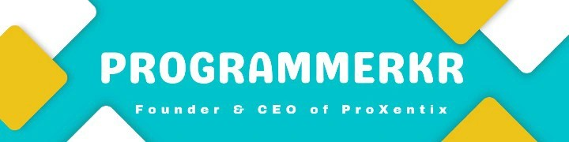

  

   
   

  

  

    
    
  

  

    
    
    
  

 

## 🚀 **Executive Summary**

I am a dedicated **Systems Programmer and Compiler Engineer** from India, with a deep fascination for low-level systems, compiler internals, and innovative language design. My mission is to build highly optimized architectural stacks and empower developers with expressive modern tooling.

- 🛠 **Founder & CEO:** Leading [ProXentix](https://proxentix.com), pushing the boundaries of technology and innovation.
- ⚙️ **Flagship Architecture:** Creator of [ProXPL](https://proxpl.in), a high-performance programming language built for precision and advanced development workflows.
- 🌱 **Deep-Diving Into:** Compiler Design, Virtual Machine Architectures, and Concurrent Systems Programming.
- 🤝 **Let's Collaborate On:** Programming Language Theory, Systems Architectures, and Open Source Software.

 

## 🌟 **Featured Innovation: ProX Programming Language**

> **[ProXPL](https://github.com/ProgrammerKR/ProXPL)** is engineered from the ground up for speed, extreme efficiency, and fluid logic representation. It bridges the gap between intense bare-metal systems execution and graceful high-level expressivity.

  

 

## ⚡ **Tech Stack & Arsenal**

  
<strong>Core & Systems</strong>

  

  
<strong>Frontend & Web</strong>

  

  
<strong>Backend & Databases</strong>

  

  
<strong>DevOps, Architecture & Tools</strong>

  

 

## 📈 **GitHub Analytics & Impact**

  <table border="0" style="border:none; box-shadow:none;">
    <tr>
      <td align="center" style="border:none; background:none;">
        
      </td>
      <td align="center" style="border:none; background:none;">
        
      </td>
    </tr>
    <tr>
      <td colspan="2" align="center" style="border:none; background:none;">
        
      </td>
    </tr>
  </table>

   
  
  <h3>🔥 <b>Contribution Activity</b> 🔥</h3>
  <picture>
    <source media="(prefers-color-scheme: dark)" srcset="https://raw.githubusercontent.com/programmerkr/programmerkr/output/github-contribution-grid-snake-dark.svg">
    <source media="(prefers-color-scheme: light)" srcset="https://raw.githubusercontent.com/programmerkr/programmerkr/output/github-contribution-grid-snake.svg">
    
  </picture>

 

## 🏆 **Trophies & Milestones**

  

 

## 📞 **Connect & Network**

<i>Always open for interesting engineering conversations, tech architecture discussions, or collaboration on Next-Gen tooling.</i>

  
  
  
  

 

  <i>"Code is like humor. When you have to explain it, it’s bad."</i>  
  <b>Stay Curious, Keep Building. 🚀</b>

